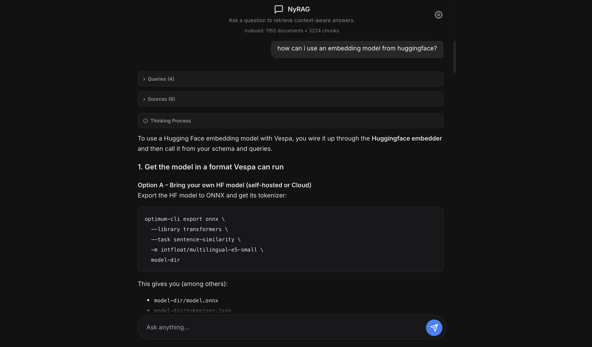

# NyRAG

A simple tool for building RAG applications by crawling websites or processing documents, then deploying to Vespa for hybrid search with an integrated chat UI.



## How It Works

When a user asks a question, NyRAG performs a multi-stage retrieval process:

1. **Query Enhancement**: An LLM generates additional search queries based on the user's question and initial context to improve retrieval coverage
2. **Embedding Generation**: Each query is converted to embeddings using the configured SentenceTransformer model
3. **Vespa Search**: Queries are executed against Vespa using nearestNeighbor search with the `best_chunk_score` ranking profile to find the most relevant document chunks
4. **Chunk Fusion**: Results from all queries are aggregated, deduplicated, and ranked by score to select the top-k most relevant chunks
5. **Answer Generation**: The retrieved context is sent to an LLM (via OpenRouter) which generates a grounded answer based only on the provided chunks

This multi-query RAG approach with chunk-level retrieval ensures answers are comprehensive and grounded in your actual content, whether from crawled websites or processed documents.


## Installation

```bash
pip install nyrag
```

We recommend `uv`:

```bash
uv init --python 3.10
uv venv
uv sync
source .venv/bin/activate
uv pip install -U nyrag
```

For development:

```bash
git clone https://github.com/abhishekkrthakur/nyrag.git
cd nyrag
pip install -e .
```

## Quick Start

nyrag operates in two deployment modes (**Local** or **Cloud**) and two data modes (**Web** or **Docs**):

| Deployment | Data Mode | Description |
|------------|-----------|-------------|
| Local | Web | Crawl websites → Local Vespa Docker |
| Local | Docs | Process documents → Local Vespa Docker |
| Cloud | Web | Crawl websites → Vespa Cloud |
| Cloud | Docs | Process documents → Vespa Cloud |

---

## Local Mode

Runs Vespa in a local Docker container. Great for development and testing.

### Web Crawling (Local)

```bash
export NYRAG_LOCAL=1

nyrag --config configs/example.yml
```

Example config for web crawling:

```yaml
name: mywebsite
mode: web
start_loc: https://example.com/
exclude:
  - https://example.com/admin/*
  - https://example.com/private/*

crawl_params:
  respect_robots_txt: true
  follow_subdomains: true
  user_agent_type: chrome

rag_params:
  embedding_model: sentence-transformers/all-MiniLM-L6-v2
  chunk_size: 1024
  chunk_overlap: 50
```

### Document Processing (Local)

```bash
export NYRAG_LOCAL=1

nyrag --config configs/doc_example.yml
```

Example config for document processing:

```yaml
name: mydocs
mode: docs
start_loc: /path/to/documents/
exclude:
  - "*.csv"

doc_params:
  recursive: true
  file_extensions:
    - .pdf
    - .docx
    - .txt
    - .md

rag_params:
  embedding_model: sentence-transformers/all-mpnet-base-v2
  chunk_size: 512
  chunk_overlap: 50
```

### Chat UI (Local)

After crawling/processing is complete:

```bash
export NYRAG_CONFIG=configs/example.yml
export OPENROUTER_API_KEY=your-api-key
export OPENROUTER_MODEL=openai/gpt-5.1

uvicorn nyrag.api:app --host 0.0.0.0 --port 8000
```

Open http://localhost:8000/chat

### Notes & Blog Generation (Local)

NyRAG includes a built-in notes system with RAG-powered blog generation:

1. **Notes UI**: Click the "Notes" link in the chat header or go to http://localhost:8000/notes
2. **Create notes**: Write markdown notes with tags and embedded images
3. **Generate blogs**: Ask the chat to "write a blog about [topic]" using your notes as context
4. **Blog templates**: Choose from tutorial, opinion, roundup, or technical templates

Example blog generation prompts:
- "Generate a blog post about Vespa ranking"
- "Write a tutorial on hybrid search"
- "Create a roundup post covering vector databases"

---

## Cloud Mode

Deploys to Vespa Cloud for production use.

### Web Crawling (Cloud)

```bash
export NYRAG_LOCAL=0
export VESPA_CLOUD_TENANT=your-tenant

nyrag --config configs/example.yml
```

### Document Processing (Cloud)

```bash
export NYRAG_LOCAL=0
export VESPA_CLOUD_TENANT=your-tenant

nyrag --config configs/doc_example.yml
```

### Chat UI (Cloud)

After crawling/processing is complete:

```bash
export NYRAG_CONFIG=configs/example.yml
export VESPA_URL="https://<your-endpoint>.z.vespa-app.cloud"
export OPENROUTER_API_KEY=your-api-key
export OPENROUTER_MODEL=openai/gpt-5.1

uvicorn nyrag.api:app --host 0.0.0.0 --port 8000
```

Open http://localhost:8000/chat

---

## Configuration Reference

### Web Mode Parameters (`crawl_params`)

| Parameter | Type | Default | Description |
|-----------|------|---------|-------------|
| `respect_robots_txt` | bool | `true` | Respect robots.txt rules |
| `aggressive_crawl` | bool | `false` | Faster crawling with more concurrent requests |
| `follow_subdomains` | bool | `true` | Follow links to subdomains |
| `strict_mode` | bool | `false` | Only crawl URLs matching start pattern |
| `user_agent_type` | str | `chrome` | `chrome`, `firefox`, `safari`, `mobile`, `bot` |
| `custom_user_agent` | str | `None` | Custom user agent string |
| `allowed_domains` | list | `None` | Explicitly allowed domains |

### Docs Mode Parameters (`doc_params`)

| Parameter | Type | Default | Description |
|-----------|------|---------|-------------|
| `recursive` | bool | `true` | Process subdirectories |
| `include_hidden` | bool | `false` | Include hidden files |
| `follow_symlinks` | bool | `false` | Follow symbolic links |
| `max_file_size_mb` | float | `None` | Max file size in MB |
| `file_extensions` | list | `None` | Only process these extensions |

### RAG Parameters (`rag_params`)

| Parameter | Type | Default | Description |
|-----------|------|---------|-------------|
| `embedding_model` | str | `sentence-transformers/all-MiniLM-L6-v2` | Embedding model |
| `embedding_dim` | int | `384` | Embedding dimension |
| `chunk_size` | int | `1024` | Chunk size for text splitting |
| `chunk_overlap` | int | `50` | Overlap between chunks |
| `distance_metric` | str | `angular` | Distance metric |
| `max_tokens` | int | `8192` | Max tokens per document |

### Pipeline Parameters (`rag_params.pipeline`)

The LangChain-based ingestion pipeline provides advanced configuration options:

| Parameter | Type | Default | Description |
|-----------|------|---------|-------------|
| `chunking_strategy` | str | `recursive` | Chunking strategy: `fixed`, `recursive`, `semantic` |
| `chunk_size` | int | `512` | Chunk size for pipeline (overrides rag_params.chunk_size) |
| `chunk_overlap` | int | `50` | Overlap between chunks |

**Chunking Strategies:**
- `fixed`: Character-based fixed-size splitting. Best for code and structured data.
- `recursive`: Smart splitting by paragraphs, sentences, words (default). Best for general content.
- `semantic`: Sentence-based NLP splitting using spacy. Best for articles and documentation.

#### Text Embedding (`rag_params.pipeline.text_embedding`)

| Parameter | Type | Default | Description |
|-----------|------|---------|-------------|
| `model` | str | `sentence-transformers/all-MiniLM-L6-v2` | HuggingFace model name |
| `batch_size` | int | `32` | Batch size for embedding |
| `device` | str | `cpu` | Device: `cpu`, `cuda`, `mps` |

#### Image Embedding (`rag_params.pipeline.image_embedding`)

| Parameter | Type | Default | Description |
|-----------|------|---------|-------------|
| `enabled` | bool | `false` | Enable image embedding for multimodal search |
| `model` | str | `sentence-transformers/clip-ViT-B-32` | CLIP model for images |
| `batch_size` | int | `16` | Batch size for image embedding |
| `device` | str | `cpu` | Device: `cpu`, `cuda`, `mps` |
| `max_dimension` | int | `1024` | Resize images to max dimension |

**Example with pipeline configuration:**

```yaml
rag_params:
  embedding_model: sentence-transformers/all-mpnet-base-v2
  embedding_dim: 768

  pipeline:
    chunking_strategy: semantic
    chunk_size: 512
    chunk_overlap: 50

    text_embedding:
      model: sentence-transformers/all-mpnet-base-v2
      batch_size: 32
      device: cuda

    image_embedding:
      enabled: true
      model: sentence-transformers/clip-ViT-B-32
      device: cuda
```

**Configuration Validation:**

You can validate your pipeline configuration before processing:

```bash
nyrag --config configs/example.yml --validate
```

This checks:
- Chunking strategy is valid
- Embedding model can be loaded
- Embedding dimensions match Vespa schema
- Image embedding model (if enabled)

### Notes Parameters (`notes_params`)

| Parameter | Type | Default | Description |
|-----------|------|---------|-------------|
| `storage_path` | str | `./data/notes` | Directory for notes JSONL storage |
| `assets_path` | str | `./data/notes/assets` | Directory for uploaded images |
| `index_on_save` | bool | `true` | Index notes in Vespa on save |

### Blog Parameters (`blog_params`)

| Parameter | Type | Default | Description |
|-----------|------|---------|-------------|
| `output_path` | str | `./data/blogs` | Directory for generated blog files |
| `default_template` | str | `tutorial` | Default template: tutorial, opinion, roundup, technical |
| `include_sources` | bool | `true` | Include source citations in generated blogs |

---

## Environment Variables

### Deployment Mode

| Variable | Description |
|----------|-------------|
| `NYRAG_LOCAL` | `1` for local Docker, `0` for Vespa Cloud |

### Local Mode

| Variable | Description |
|----------|-------------|
| `NYRAG_VESPA_DOCKER_IMAGE` | Docker image (default: `vespaengine/vespa:latest`) |

### Cloud Mode

| Variable | Description |
|----------|-------------|
| `VESPA_CLOUD_TENANT` | Your Vespa Cloud tenant |
| `VESPA_CLOUD_APPLICATION` | Application name (optional) |
| `VESPA_CLOUD_INSTANCE` | Instance name (default: `default`) |
| `VESPA_CLOUD_API_KEY_PATH` | Path to API key file |
| `VESPA_CLIENT_CERT` | Path to mTLS certificate |
| `VESPA_CLIENT_KEY` | Path to mTLS private key |

### Chat UI

| Variable | Description |
|----------|-------------|
| `NYRAG_CONFIG` | Path to config file |
| `VESPA_URL` | Vespa endpoint URL (optional for local, required for cloud) |
| `OPENROUTER_API_KEY` | OpenRouter API key for LLM |
| `OPENROUTER_MODEL` | LLM model (e.g., `openai/gpt-4o`) |

---
